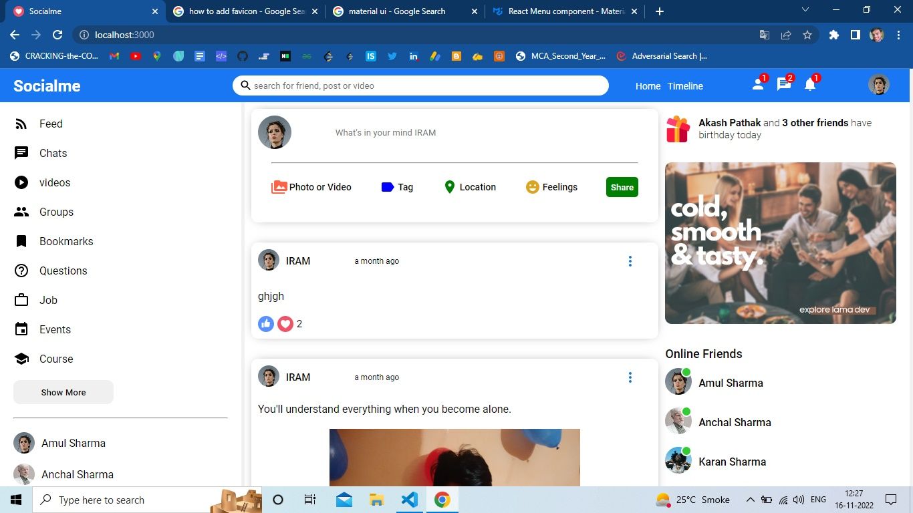

# Socialme

Socialme is a social networking application that replicates the features and functionalities of the popular Facebook platform. It allows users to create profiles, connect with friends, share photos and videos, post updates, and engage in various activities such as commenting, liking, and sharing.

## Landing Page

## Profile Page

Additional description about the project and its features.
## Built With
 - HTML
 - CSS
 - JAVASCRIPT
 - REACT
 - MongoDB
 - Material UI
 - EXPRESS
 - NODEJS
 
 ## Live Demo
[Live Demo Link 👈]()

## Getting Started
- Follow the live demo link and enjoy the site.
### Usage
- To get a local copy up and running follow these simple example steps.
Clone the repository unto your local machine cd to the folder separately for API and Frontent and  and type "npm start"

 ### Run tests
- There is no automated tests for this project.

### Future features
- API CRUD Operation, Authenticaion, user-friendly interface, personalized news feed, like, comment, share posts. and Privacy & Policy.

## Author
 ### 👤 Amul Sharma
 - Email: sharmaamul64@gmail.com
 - Twitter: [@Twitter](https://twitter.com/Amul_Sharma64)
 - Linkdin: [@Linkdin](https://www.linkedin.com/in/amul-sharma2000)
 
## Show your support
Give a ⭐️ if you like this project!

## 📝 License
This project is  licensed.
